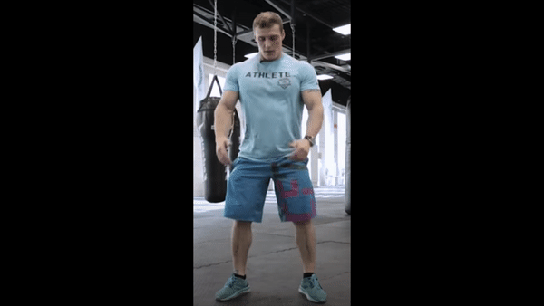
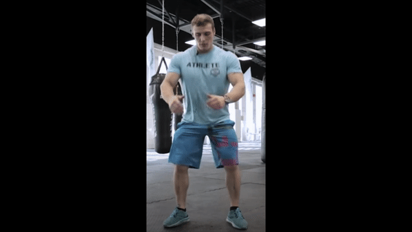
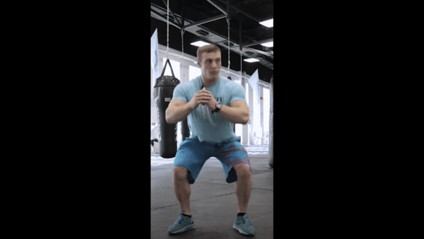
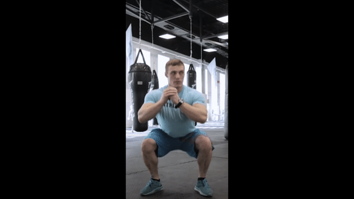

#Vision Hackathon project

## The goal
To help people complete sport exercises without pro trainer using machine learning.

## Train model
We need to understand which exercise person do now and level of quality of moves.

On this step I use this video as reference squat.

 
I cut this video into short parts to produce little steps, which will become  classical machine learning problems.

I had 4 steps which must follow one by one from first to last and from last to first. This give us opportunity to count exercises and understand quality of person moves.
Lets teach our model. (I used [Teachable Machine](https://teachablemachine.withgoogle.com) for this task). 

Every step will be an own class. We must got photos from every short video, and upload them. 

Result of model: 

## Result
Using algorithms and our model we can do all what we want with camera and canvas.

 

Also you can [try it](https://koobi33.github.io/visionHack/) yourself.

## Next steps
You can use more data to train powerful model for best results and train it for another exercises.  

